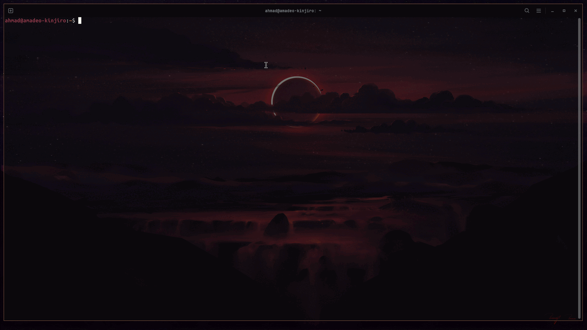

# dwm - ubuntu 24.04

This repository contains a fully automated, dynamic desktop environment based on the [dwm](https://dwm.suckless.org/) (dynamic window manager) and [dmenu](https://tools.suckless.org/dmenu/) from Suckless. It is specifically designed and optimized for Ubuntu 24.04 LTS.

The setup features a "Material-Black-Blueberry" aesthetic, powered by [Wallust](https://explosion-mental.codeberg.page/wallust/intro.html) for real-time color generation across the entire system.

> --> This project is provided "as is" and without any warranty. It works perfectly on my three personal laptops, but I cannot guarantee it will work on yours.

## Demo



## Performance Benchmark

This setup is optimized for efficiency. Below is a real-world comparison between the standard Ubuntu 24.04 (GNOME) session and this `dwm` suite, tested on my hardware.

| Metric | Ubuntu 24.04 (GNOME) | dwm - ubuntu 24.04 | Benefit |
| :-----: | :-----: | :-----: | :-----: |
| **Idle RAM Usage** | 2345 MB | **1586 MB** | **-759 MB Saved** |
| **Running Processes** | 327 | **313** | **Leaner System** |
| **Boot to Desktop** | 50.5s | **48.8s** | **Instant Start** |

### Why these numbers matter
While standard Ubuntu is feature-rich, it is heavy. By switching to `dwm`, we reduce the memory footprint by nearly **1 GB**. This keeps your CPU and RAM available for actual work, not for managing the desktop environment itself.

--> *Note: Benchmarks were taken on a clean boot with no additional applications open.*

## Installation

The setup is designed to be completed with a single command.

1. Clone the repository:

```bash
git clone https://github.com/Ahmadalzin95/dwm.git ~/suckless ~/suckless
cd ~/suckless
```

2. Run the setup script:
```bash
chmod +x setup.sh
./setup.sh
```
3. Switch Session: Once the script finishes, log out of your current session. At the Ubuntu login screen, click the small gear icon in the bottom right corner, select dwm, and log back in.

## System Scripts

All logic is contained within the [scripts/](https://github.com/Ahmadalzin95/dwm/tree/main/scripts) directory. Here is a brief overview of the custom tools:


| Script | Function |
| ------ | -------- |
| `apply-theme`| Changes wallpaper and forces Wallust to regenerate system colors instantly.|
| `app_manager` | Lists running X11 windows in dmenu and allows you to terminate them. |
| `autostart` | Runs background services and initializes monitor layouts. |
| `bt_status` | Provides Bluetooth connectivity status for the slstatus bar. |
| `dwm-menu` | System hub for WiFi, Bluetooth, VPN, and Power management. |
| `hw_status` | Detects hardware interfaces (`WiFi`, `Battery`, `Temp`) for bar monitoring. |
| `layout_toggle` | Cycles keyboard layouts (`US`, `DE`, `AR`) with system notifications. |
| `lock` | Activates a blurred lockscreen via [Betterlockscreen](https://github.com/betterlockscreen/betterlockscreen). |
| `monitor.sh` | Sets the Xrandr monitor resolution and positioning. |
| `screenshot` | Advanced screen capture tool for `areas`, `windows`, or `full monitors`. |

## Shortcuts & Control

This configuration uses Alt (Mod1) as the main key and Super (Windows Key) for system functions.

### Navigation & Apps

* `Alt + p`: Open App Launcher (Desktop applications only)
* `Alt + Shift + p`: Open Command Launcher (dmenu_run)
* `Alt + Shift + Enter`: Open Gnome-Terminal
* `Alt + s`: Open System Menu (Power/WiFi/VPN)
* `Alt + x`: Open App Manager (Kill running apps)
* `Super + p`: Open nsxiv Image Gallery

### Window Management

* `Alt + j / k`: Focus next/previous window

* `Alt + Shift + c`: Close focused window

* `Alt + b`: Toggle Status Bar visibility

* `Alt + Enter`: Swap focused window to Master

* `Alt + Ctrl + Shift + q`: Restart dwm

### Hardware & Media

* `Super + Space`: Toggle Keyboard Layout (US -> DE -> AR)

* `Super + l`: Lock Screen

* `PrintScreen`: Capture Full Monitor

* `Super + s`: Capture Selected Area

* `Audio Keys`: Volume Up/Down/Mute (with notifications)

* `Brightness Keys`: Display Brightness Up/Down (with notifications)

## Custom Theming
The system uses a dynamic theming engine. You can change your entire system look by running:
```bash
apply-theme </path/to/your/wallpaper.jpg>
```

## Legal & Technical Note
This build is based on source code from [suckless.org](https://suckless.org/). It includes several patches for dwm and dmenu to enable gaps, centering, and desktop file support.